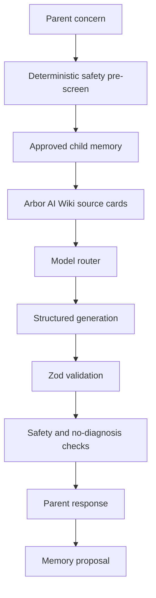

# Arbor AI Pipeline

## Current state

Arbor screens obvious safety risks, calls an AI model, renders structured guidance, and proposes memory for parent review.

## Target state

## Migration path

`/api/chat` now retrieves approved memory, AI Wiki source cards, calls the configured model route, and validates with Zod.

## M1 acceptance gates

- Invalid structured output fails safely.
- `sourceCardsUsed` is present in the coach contract.
- High-risk content bypasses generation and routes to escalation copy.
