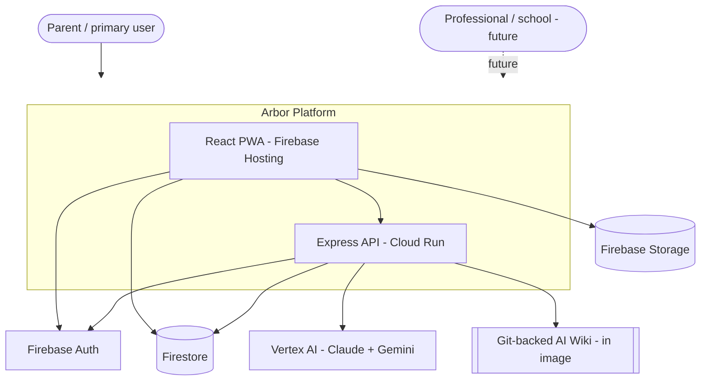
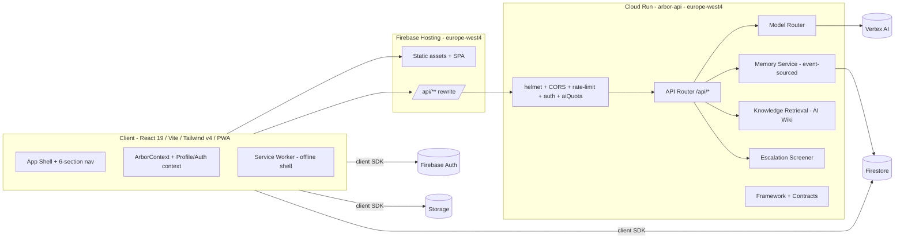
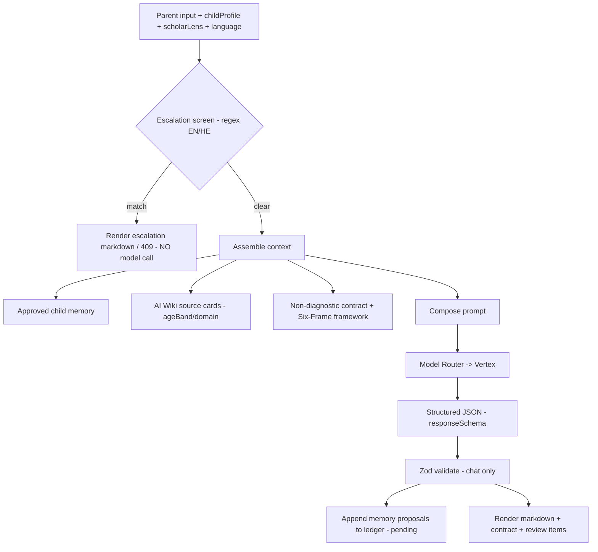
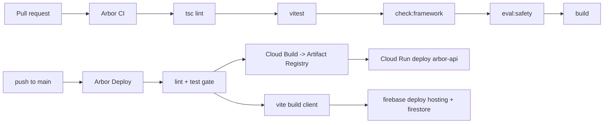

# Arbor — System Architecture Document

**Version:** 1.0
**Date:** 2026-06-04
**Status:** Living document — reflects the production-deployed `main` (v3 Wave 7)
**Scope:** All components: client, API, AI pipeline, data, knowledge, safety, identity, infra, CI/CD.
**Audience:** Engineering, architecture review, compliance, future maintainers.

> Companion documents: [Well-Architected Assessment](./well-architected-assessment-2026-06-04.md)
> and the [WAF Enhancement Backlog](./enhancement-backlog-waf-2026-06-04.md). The thin
> per-topic stubs in this folder (`security-privacy.md`, `target-architecture.md`,
> `model-routing.md`, `data-model-firestore.md`, …) are superseded by this consolidated doc
> but retained for ADR traceability.

---

## 1. Purpose & Context

Arbor is an AI-powered child-development and parenting-support platform (birth–12),
targeting EU markets (Israel, Netherlands, Belgium first). It processes **special-category
personal data about children** (developmental, behavioral, health-adjacent observations),
which is the dominant constraint on every architectural decision.

The product thesis is that the moat is **longitudinal, parent-approved child memory +
expert-reviewed developmental knowledge + structured safety**, not the model. The
architecture reflects this: a disciplined AI pipeline with structured contracts, a
Git-backed knowledge base, an event-sourced memory ledger, and safety screening that sits
*in front of* the model.

### Deployment reality (today)
- Single-tenant private beta (parent "Guy", child "Dylan"), but the data model and rules
  are already multi-family / multi-child / multi-org capable.
- Region: **`europe-west4`** (Netherlands) for data residency.
- Live surface: six-capability IA (Home · Ask Arbor · Child Intelligence · Growth Plans ·
  Care Network · Arbor Academy) on a PWA shell.

---

## 2. C4 Level 1 — System Context



**External dependencies / trust boundaries**
| Dependency | Role | Trust / data-flow note |
|---|---|---|
| Firebase Auth | Identity (Google OAuth + email/password) | Issues ID tokens verified by API |
| Firestore | System of record for child data, memory ledger, AI run log | Client SDK (rules-enforced) **and** Admin SDK (server) both write |
| Firebase Storage | Photo attachments on logs (≤5 MB, own-path) | Client-direct, rules-enforced |
| Vertex AI | Claude 3.5 Sonnet (coach) + Gemini 2.5 Flash (story/analysis/handoff) | Child PII leaves the boundary in prompts — see §6.4 |
| Firebase Hosting | Static client + `/api/**` rewrite to Cloud Run | CDN edge, EU |
| GCP Cloud Build / Artifact Registry | Build + image registry | CI/CD path |

---

## 3. C4 Level 2 — Container View



### 3.1 Client container
- **Stack:** React 19, TypeScript, Vite 6, Tailwind v4, `motion` (Framer), `recharts`,
  `@dnd-kit`, `canvas-confetti`, `lucide-react`. PWA (`sw.js`, `manifest.webmanifest`).
- **State:** Context-based (`ArborContext`, profile/auth contexts); user-generated data is
  increasingly Firestore-backed via `onSnapshot`, with **localStorage as the sandbox-mode
  fallback** when `VITE_FIREBASE_*` is absent.
- **Routing:** URL-hash routing (IA-1); six top-level sections with sub-nav; command palette.
- **Design system:** "Soft Daylight" / warm parchment — design tokens in `index.css`
  (`--arbor-paper`, `--arbor-clay`, `--arbor-ink`). Intentionally not a UI library.

### 3.2 API container (`arbor-api`, Cloud Run)
Express 4 app assembled in `app/src/server/createApp.ts`. Middleware chain (in order):
1. `helmet({ contentSecurityPolicy: false })`
2. CORS allowlist (`config.corsOrigins`)
3. IP rate limit — **30 req/min** on `/api` (`express-rate-limit`, in-memory store)
4. `express.json({ limit: "250kb" })`
5. `createAuthMiddleware` — Firebase ID-token verification (enforced when `REQUIRE_AUTH=true`)
6. `aiQuota` — **80 AI req/hour/user**, in-memory, on the five generative endpoints
7. API router

### 3.3 Backend modules
| Module | Path | Responsibility |
|---|---|---|
| Config / env invariants | `config/env.ts` | Typed config; **prod refuses to boot** unless `MODEL_PROVIDER=vertex`, `MEMORY_ADAPTER=firestore`, local adapter off, project IDs set |
| Model router | `ai/modelRouter.ts`, `ai/claudeVertexProvider.ts` | Route → provider/model selection; JSON + streaming generation |
| API routes | `routes/api.ts` | 11 endpoints (chat, plan, story, hero-journey, analyze, handoff, memory CRUD, onboarding, professionals, architecture status/knowledge) |
| Contracts | `contracts/coach.ts` | Non-diagnostic contract, Zod + Gemini response schemas, markdown renderer |
| Safety | `safety/escalation.ts` | Pre-LLM regex escalation screen (EN/HE), 5 categories |
| Memory | `memory/*` | Event-sourced ledger, fold to current state, Firestore/local adapters |
| Knowledge | `knowledge/wiki.ts` | Git-backed source-card retrieval (RAG-lite) |
| Framework | `services/framework.ts` | Developmental framework prompt + domain enum from `framework.json` |
| Services | `services/professionals.ts` | Curated Care Network directory (in-code) |

---

## 4. Component & Endpoint Map

| Endpoint | Method | Route | Safety pre-screen | Model route | Output validation |
|---|---|---|---|---|---|
| Parent Coach | POST | `/api/chat` | ✅ input regex | `coach_high_stakes` → **Claude** | Zod (`coachResponseZodSchema`) |
| Action Plan | POST | `/api/generate-plan` | ✅ (409 block) | `analysis_structured` → Gemini | Gemini schema only |
| Story | POST | `/api/generate-story` | ✅ (409 block) | `creative_low_risk` → Gemini | Gemini schema only |
| Hero Journey | POST | `/api/generate-hero-journey` | ✅ on fixed theme | `creative_low_risk` → Gemini | Gemini schema; **plot fixed in catalog** |
| Behavior analysis | POST | `/api/analyze-behavior` | ✅ (409 block) | `analysis_structured` → Gemini | Gemini schema only |
| Handoff brief | POST | `/api/generate-handoff` | ✅ (409 block) | `handoff_structured` → Gemini | Gemini schema only |
| Memory list | GET | `/api/memory/:childId` | n/a | — | folds ledger events |
| Memory transition | PATCH | `/api/memory/:memoryId` | n/a | — | status enum guard |
| Onboarding | POST | `/api/onboarding/family-child` | n/a | — | required-field guard |
| Professionals | GET | `/api/professionals` | n/a | — | filter only |
| Architecture status/knowledge | GET | `/api/architecture/*` | n/a | — | introspection |

> **Note:** Only `/api/chat` re-validates model output with Zod. The other five generative
> endpoints trust the provider's `responseSchema` and forward output directly — a hardening
> gap tracked as **SEC-7 / AI-4** in the backlog.

---

## 5. Data Architecture

### 5.1 Firestore model
```
users/{uid}                         # owner-only (rules: uid == auth.uid, recursive)
  children/{childId}/
    behaviorLogs, milestones, actionPlans, savedStories,
    contacts, weeklyReports, insights, settings, memories
families/{familyId}                 # member-gated
  members/{memberId}                # self-write only
children/{childId}                  # family-scoped read/update; create if signed-in
  {subcollection}/{docId}           # canReadChild(childId)
  memoryEvents/{eventId}            # event-sourced memory ledger (indexed childId+createdAt)
aiRuns/{runId}                      # append-only AI run log (owner-read, create-only)
safetyReviews/{reviewId}           # write-only ledger (create only; no read/update/delete)
organizations/{orgId}/**           # locked (read,write: false) — future B2B/B2G
```

**Two parallel ownership models coexist:** the simple `users/{uid}/children/**` tree
(single-parent today) and the `families/ + children/` tree (multi-caregiver target). This
duality is intentional but must be reconciled before multi-caregiver GA (see DATA-1).

### 5.2 Memory ledger (the moat surface)
- **Event-sourced:** `memoryEvents` are append-only (`proposed → approved/rejected/edited/
  deleted/expired`); current state is derived by `foldMemoryEvents`.
- AI proposes memory; **parent approval is required** before a fact is injected into coach
  context (`getApprovedMemoryContext` only reads approved). This is a deliberate
  human-in-the-loop privacy control and a GDPR data-minimization lever.

### 5.3 Storage
- `users/{uid}/**`, own-path read/write, **≤5 MB** per object (`storage.rules`). No content-type
  or malware scanning yet.

---

## 6. AI Architecture (the core differentiator)

### 6.1 Pipeline


### 6.2 Model routing
| Route | Provider (prod) | Model | Rationale |
|---|---|---|---|
| `coach_high_stakes` | Vertex **Claude** | `claude-3-5-sonnet-v2@20241022` | Highest-stakes parent guidance |
| `creative_low_risk` | Vertex Gemini | `gemini-2.5-flash` | Stories |
| `analysis_structured` | Vertex Gemini | `gemini-2.5-flash` | Plans, behavior analysis |
| `handoff_structured` | Vertex Gemini | `gemini-2.5-flash` | Professional briefs |

Dev/local uses the Gemini Developer API directly (`gemini-2.5-flash`). Provider selection is
config-driven and prod-locked to Vertex (`env.ts`).

### 6.3 Safety controls (defense layers present today)
1. **Input escalation screen** (`safety/escalation.ts`) — 5 categories (self-harm, abuse/
   unsafe home, urgent medical, developmental regression, caregiver distress), EN + Hebrew
   regex, runs **before** any model call.
2. **Non-diagnostic contract** prepended to every generative prompt.
3. **Structured output contract** — coach output must carry `riskLevel`, `escalateIf`,
   `nonDiagnosticHypotheses` (with confidence), `frameRouting`, etc.; Zod-validated for chat.
4. **High-risk review queue** — `safetyReviews` write-only ledger + `ENABLE_HIGH_RISK_REVIEW_QUEUE`.
5. **AI run log** — `aiRuns` append-only for traceability.
6. **CI safety eval** — `npm run eval:safety` gates every PR and the deploy.
7. **Knowledge grounding** — coach answers cite `sourceCardsUsed` from the Git-backed wiki.

### 6.4 Known AI-architecture exposures (detailed in assessment)
- Full `childProfile` (incl. name) is `JSON.stringify`-ed into prompts → child PII to the model
  with no redaction/tokenization layer.
- Escalation is **regex-only** — brittle to paraphrase and to languages beyond EN/HE; no
  semantic/LLM safety classifier on input or output.
- **No output-side safety/groundedness classification** beyond schema shape.
- **Prompt-injection surface:** approved memory + wiki cards + free-text user message are
  concatenated into one prompt; memory/notes are untrusted text.
- Five of six generative endpoints **skip Zod re-validation**.

---

## 7. Identity, Security & Privacy (as-built)

| Control | Implementation | Note |
|---|---|---|
| AuthN | Firebase Auth (Google + email/pw), ID-token verify in API | Enforced via `REQUIRE_AUTH=true` in stage/prod |
| AuthZ (data) | Firestore + Storage rules | Owner-only `users/**`; family-gated `children/**` |
| Transport | HTTPS (Hosting + Cloud Run managed) | TLS terminated at Google edge |
| At rest | Firestore/Storage default encryption | No CMEK |
| CORS | Allowlist from `CORS_ORIGINS` | Rejects unknown origins |
| Rate / cost | 30/min IP + 80/hr/user AI | **In-memory → not global across instances** |
| Secrets | GitHub Actions secrets; prod uses **ADC** (no SA key needed at runtime) | But `GCP_SA_KEY` long-lived JSON used in deploy |
| Headers | Helmet, **CSP disabled** | Hardening gap |
| Network | Cloud Run `--allow-unauthenticated` + app-layer auth | Public endpoint by design |

Residency is EU (`europe-west4`). Compliance docs exist but are thin: data-retention,
DPA outline, incident-response, non-diagnostic disclaimer, privacy notes. **No DPIA**
despite children's data + profiling (GDPR Art. 35 trigger).

---

## 8. Deployment & CI/CD



- **CI** (`arbor-ci.yml`): lint (`tsc --noEmit`), unit tests (vitest, 10 test files),
  framework structure check, **safety eval**, build. Runs on PR + main.
- **Deploy** (`arbor-deploy.yml`): on push to `main`, re-runs lint+test, then Cloud Build
  → Cloud Run, then client build + `firebase deploy --only hosting,firestore`. Single
  environment (`production`), `concurrency: cancel-in-progress`.
- **Image:** multi-stage `node:22-slim`; prod deps only; knowledge + `framework.json` baked
  into image (knowledge is immutable per release).
- **Prod invariants enforced in code** (`env.ts`) — defense against misconfiguration.

**Gaps:** no staging gate before prod, no post-deploy smoke test, no automated rollback,
no image/dependency vulnerability scanning, no SBOM, deploy uses a long-lived SA key
(no Workload Identity Federation).

---

## 9. Observability (current)

Effectively **`console.log` / `console.error` → Cloud Run stdout → Cloud Logging.** No
structured logging, no distributed tracing, no metrics/SLOs, no error tracker, no alerting,
no token/cost telemetry, no DORA-metric instrumentation. `aiRuns` provides partial AI
audit. This is the single largest operational-maturity gap.

---

## 10. Quality attributes — quick reference

| Attribute | Today | Target driver |
|---|---|---|
| Availability | Single-region Cloud Run + managed Firestore; no DR runbook | Beta-acceptable; define SLO before GA |
| Scalability | Cloud Run autoscale; **in-memory caps don't scale horizontally** | Move caps to Firestore/Redis |
| Latency | SSE streaming on chat; cold starts (lazy Vertex import, no min instances) | Min instances + warmup |
| Cost | Claude on every coach turn; soft caps | Cost telemetry + hard caps |
| Security | Auth + rules solid; CSP off, in-mem caps, PII-to-LLM | See assessment |
| Privacy/compliance | EU residency, parent-approved memory; no DPIA/export/delete | GDPR program |
| Safety | Strong, layered, regex-bounded | Add semantic classifier + HITL SLA |

---

## 11. Architectural decisions (ADRs in `docs/adr/`)
- ADR-0001 Vertex AI on GCP · ADR-0002 Firestore for app data · ADR-0003 AI Wiki knowledge
  base · ADR-0004 Model routing, Claude primary for coach.

New decisions recommended by the assessment (CSP policy, WIF for deploy, semantic safety
classifier, global rate/cost store, DPIA) should each land as new ADRs.

---

## 12. Glossary
- **Six Frames** — product philosophy (Aim, Two Axes, Story, Shadow, Marriage, Shepherd);
  every coach answer routes through them (`frameRouting`).
- **AI Wiki / source cards** — Git-backed markdown developmental knowledge with YAML
  frontmatter; retrieved by age band/domain and cited by the coach.
- **Memory ledger** — event-sourced, parent-approved child-memory store; the moat.
- **Escalation screen** — deterministic pre-model safety gate.
```
