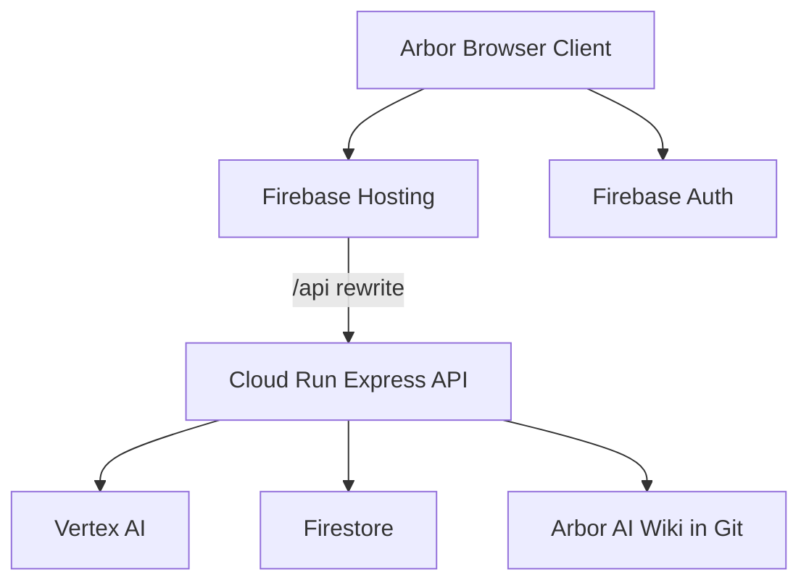

# Arbor M1 System Context

## Current state

The current private-beta app is a single Express service serving API routes and the built frontend.

## Target state

## Migration path

Keep Express as the orchestration unit. Add Firebase Auth middleware after anonymous onboarding is implemented.

## M1 acceptance gates

- Cloud Run health and API routes deploy as one service.
- Firebase Hosting rewrites `/api/*` to Cloud Run.
- No Cloud Functions rewrite for Arbor orchestration.
