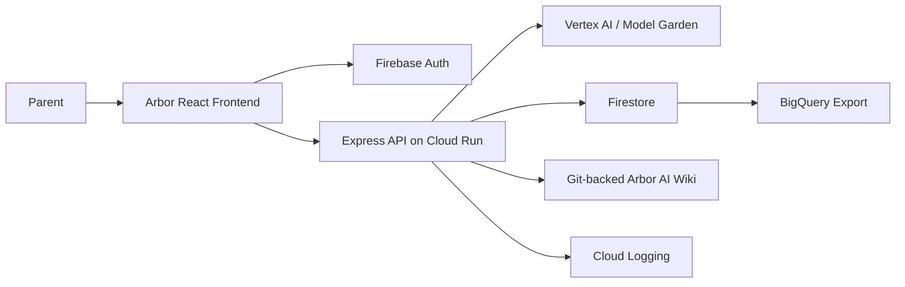

# Arbor Target Architecture

## Current state

Arbor has a React/Vite frontend, an Express API, structured coach output, safety pre-screening, and a local development memory ledger.

## Target state

Arbor runs on Google Cloud:

## Migration path

1. Route AI through `ModelProvider` and config-driven model routes.
2. Use Firestore as the production memory/event ledger.
3. Add Firebase Auth anonymous-first identity and API token verification.
4. Deploy Express on Cloud Run and the frontend on Firebase Hosting.

## M1 gates

- `ARBOR_ENV=prod` requires `MODEL_PROVIDER=vertex`.
- `ARBOR_ENV=prod` requires `MEMORY_ADAPTER=firestore`.
- Approved memory only is injected into coach context.
- Arbor AI Wiki source cards are available to `/api/chat`.
