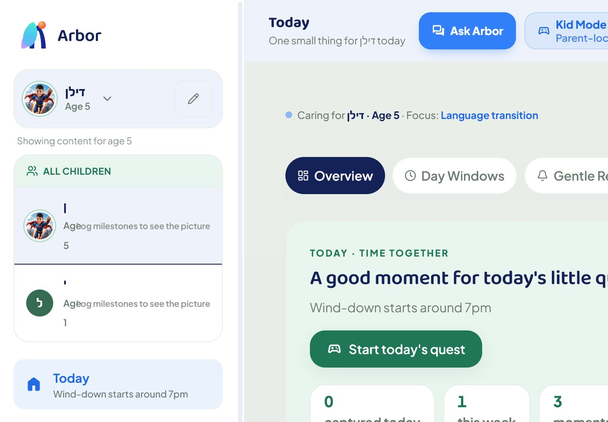
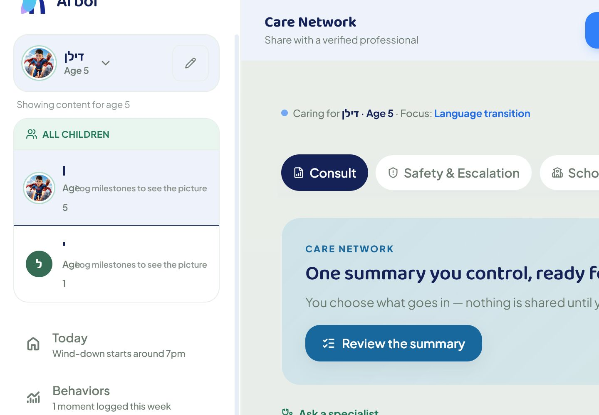
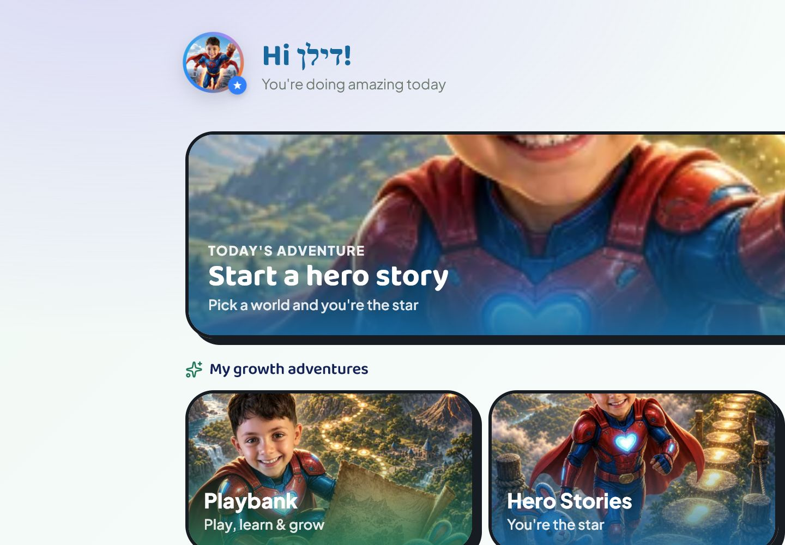
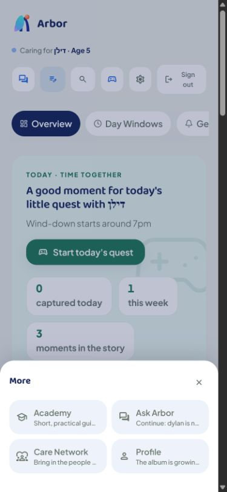
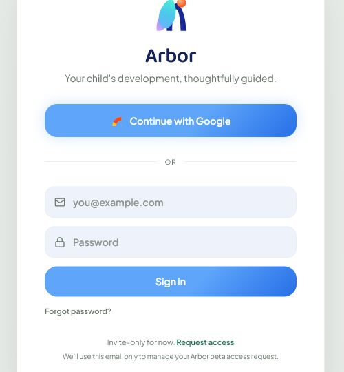
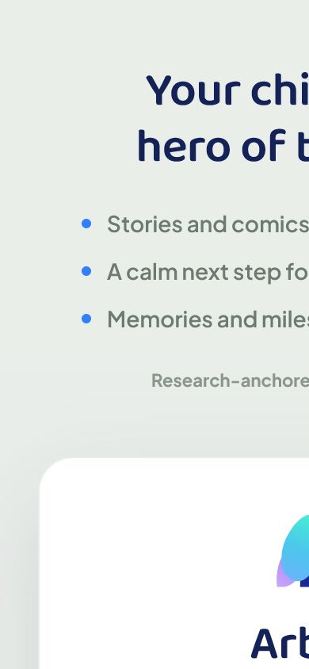

# Arbor Production Screen Audit Backlog

Date: 2026-07-10
Surface: production Arbor app
Primary URL: https://arborparentingapp.com
Fallback URL captured earlier: https://arborprd-westeu.web.app
Status: Backlog updated after authenticated production audit on the custom domain, plus current app source, canonical Arbor docs, and multi-agent product/AI/design review.

## Executive Read

Arbor already has the raw category shape of a market-leading child-development operating system: Today, Journal, Behaviors, Growth, Academy, Ask Arbor, Care Network, Profile, and Kid Mode. The next leap is not "more features." It is making every screen feel inevitable: one calm next step, visible child memory, high-trust AI, a non-addictive daily loop, and a child-as-hero emotional layer.

Authenticated production was inspected through the custom URL after signing in with the known Gmail account. Screenshots 10-20 now cover the real parent app, Kid Mode, and mobile More sheet. The earlier unauthenticated auth captures are retained only as auth/front-door QA evidence.

The strongest news: Kid Mode and the child-as-hero direction are emotionally differentiated and can be a real market wedge. The highest-risk news: the authenticated desktop shell is visibly clipped across multiple hubs, the child switcher/list has broken mixed RTL/LTR rendering, and mobile top-shell density truncates important content. The product strategy is ahead of the production polish.

Top production priorities:

1. Fix global desktop layout containment across the parent shell.
2. Fix the sidebar child switcher/list rendering, especially mixed RTL/LTR child names and age copy.
3. Make Today the true daily conductor, not a beautiful set of modules.
4. Turn Ask Arbor into a visible trust contract: read, next step, remember, escalate.
5. Turn Care Network into a parent-approved handoff packet with redaction and consent.
6. Keep Kid Mode streakless, bounded, and parent-controlled while making it the emotional proof of Arbor.

## Evidence Captured

### Authenticated Production Screens

The following screenshots were captured from the signed-in production app on `https://arborparentingapp.com`.

| Screenshot | Surface | Health |
|---|---|---|
| `10-auth-today-desktop.png` | Today desktop | Mixed: strong direction, but shell/content clipped. |
| `11-auth-behaviors-desktop.png` | Behaviors desktop | Mixed: useful framing, same shell clipping. |
| `12-auth-growth-desktop.png` | Growth desktop | Mixed: promising milestone cockpit, same clipping. |
| `13-auth-journal-desktop.png` | Journal desktop | Promising: memory promise is clear, needs capture loop depth. |
| `14-auth-academy-desktop.png` | Academy desktop | Promising: story/course surfaces are visible, jobs need sharper separation. |
| `15-auth-ask-arbor-desktop.png` | Ask Arbor desktop | Promising: calm coach framing, needs stronger answer contract. |
| `16-auth-care-network-desktop.png` | Care Network desktop | Risk: visible clipping and measured horizontal overflow. |
| `17-auth-profile-desktop.png` | Profile desktop | Mixed: account/family base exists, needs living memory controls. |
| `18-auth-kid-mode-desktop.png` | Kid Mode desktop | Strong: most emotionally differentiated surface. |
| `19-auth-mobile-today.png` | Today mobile | Mixed/risk: bottom nav works, top content truncates visually. |
| `20-auth-mobile-more-sheet.png` | Mobile More sheet | Good baseline: exposes remaining hubs; needs copy/spacing fit. |

### Screenshot 1 - Email Auth State

Earlier unauthenticated audit pass: the initial login panel was present in the DOM but did not consistently paint in the full-page capture. After selecting email sign-in, the auth card rendered and was accepted as the clearest visual evidence of the public production auth state.

Notes:
- The visual card is calm and brand-consistent.
- The first promise is good: child-as-hero, calm next step, memories over years.
- The form is invite-only but asks for password after "Continue with email," which can read like a standard failed-login path rather than a beta-access path.
- Request access is a small text link; it should be promoted for non-invited parents.

### Screenshot 2 - Mobile Capture Risk

Earlier unauthenticated audit pass: the mobile viewport capture showed horizontally shifted/clipped content, while DOM measurements reported elements within the 390px viewport. The authenticated mobile captures now confirm the bottom nav and More sheet are functional, but top content and toolbar density still need mobile fit QA.

Notes:
- Treat as a P0 visual QA risk because first impression on mobile is existential.
- Reproduce with real devices and BrowserStack or Playwright device profiles.
- Do not ship a marketing push until mobile auth/onboarding is visually verified.

## Step List

| Step | Description | Health |
|---:|---|---|
| 1 | Custom production domain + Google sign-in | Good. `arborparentingapp.com` loaded and signed in successfully. |
| 2 | Today / parent shell | Mixed/risk. Daily conductor direction is strong, but desktop content is clipped and the sidebar child list is visibly broken. |
| 3 | Behaviors | Mixed. Calm "patterns, not verdicts" positioning is right; needs scripts, editable insights, and shell containment. |
| 4 | Growth | Mixed. Milestone cockpit has useful shape; needs a closed-loop growth plan and layout fit. |
| 5 | Journal | Promising. "Small moments become story" is a strong retention idea; needs ambient capture and self-writing weekly narrative. |
| 6 | Academy | Promising. Story journeys and parent learning are visible; needs clearer jobs for courses, bedtime, and hero stories. |
| 7 | Ask Arbor | Promising/risk. Coach framing and evidence chips are present; needs visible memory, answer contract, and concern routing. |
| 8 | Care Network | Risk. Strong "summary you control" promise; measured horizontal overflow and needs redaction/consent workflow. |
| 9 | Profile | Mixed. Family/account base exists; needs "what Arbor knows" and edit/delete controls. |
| 10 | Kid Mode | Strong. Best emotional proof of the product; verify parent exit gate, consent, and no child-facing pressure mechanics. |
| 11 | Mobile Today + More | Mixed. Bottom nav and More sheet work; top hero/toolbar text truncates and needs device QA. |

## Market-Level Product Principles

1. One calm next step: every screen answers what to do now and why.
2. Memory made visible: show "Arbor noticed -> Arbor recommends -> Arbor will remember."
3. Parent cockpit plus child world: parent surfaces calm and efficient, kid surfaces alive and bounded.
4. Personalization density beats library size: choose the right activity for this child today.
5. Trust is a surface: evidence, source framing, redaction, consent, and escalation are visible controls.
6. Engagement without pressure: daily ritual, completion relief, pride, no streak anxiety.
7. Human layer at anxiety spikes: route concerns to a parent-approved expert packet.
8. The child is the hero: comics, stories, celebrations, and weekly growth moments should star the child.
9. Predict rhythms, not just log events: tracking becomes valuable when it predicts a useful window.
10. Proof loops matter: plan -> practice -> signal -> adjustment -> shareable summary.

## Screen-by-Screen Backlog

| Screen / Surface | Priority | Backlog Item | Why It Matters | Acceptance Signal |
|---|---:|---|---|---|
| Shell / Layout | P0 | Fix global desktop layout containment across every authenticated hub | The app currently looks horizontally clipped in production across Today, Behaviors, Growth, Journal, Academy, Ask Arbor, Care Network, and Profile. | At 1440px, 1280px, and 1024px desktop widths, no hub hero, tab rail, button, or card is clipped; `scrollWidth <= clientWidth` for the main shell. |
| Shell / Sidebar | P0 | Fix child switcher/list rendering for mixed RTL/LTR names and age copy | The sidebar is the trust anchor; broken child names and "Ageog milestones..." copy make the product feel unsafe even when the core idea is strong. | Active and inactive child rows render photo/initial, name, age, and helper copy correctly in English, Hebrew, and mixed text. |
| Shell / Mobile | P0 | Fit the mobile top shell and hero content without truncation | The mobile bottom nav and More sheet work, but the first screen crops important text and controls. | iPhone SE, iPhone 15, Pixel, and 390px Playwright captures show readable top nav, child context, tabs, and primary hero CTA. |
| Auth / Invite | P1 | Fix and verify production auth visual rendering across desktop and mobile | The earlier public-auth captures showed unstable initial painting; the signed-in app now works, but auth remains the first-impression gate. | Chrome, Safari, iOS, Android screenshots show full hero plus auth card with no clipping or blank panel. |
| Auth / Invite | P1 | Promote "Request access" into a first-class beta CTA | Invite-only parents should not feel they hit the wrong door. | Non-invited parent can request access in one obvious path; helper text is not the primary instruction. |
| Auth / Invite | P1 | Add "why invite-only" trust copy and expected response time | Turns exclusion into premium beta trust. | Request-access completion screen sets expectation and reduces repeat attempts. |
| Onboarding | P0 | Create a read-only production demo/audit account with seeded family data | Design QA cannot depend on private user credentials. | QA can inspect all 8 hubs and Kid Mode without touching real child data. |
| Onboarding | P0 | First-minute hero comic path | The first session must prove "child as hero" before the app feels like admin. | New family sees a personalized hero artifact within 2 minutes or a no-photo fallback. |
| Onboarding | P1 | First-steps rail as a true conductor | Onboarding should guide action, not explain features. | 60% of new accounts complete add child -> ask coach -> log moment -> create comic. |
| Shell / Nav | P1 | Living nav pulses on all 8 hubs | The sidebar should be a live map of the child, not a menu. | Every hub has a firewall-safe pulse: counts/activity only, no verdicts or percentages. |
| Shell / Nav | P1 | Mobile More sheet QA and compression pass | The 8-hub model needs mobile confidence. | 5-slot bottom nav plus More sheet exposes every hub with 44px targets and no horizontal shift. |
| Shell / Nav | P1 | Global "what changed because of me?" spine | Parents need to see compounding memory. | After every meaningful action, a ripple note shows where it feeds next. |
| Today | P0 | Today Conductor | Today must be the daily answer, not a card dump. | One time-aware hero action appears above all other modules; 45% WAU complete 3+ actions/week. |
| Today | P0 | Parent Energy Mode | Advice must fit real bandwidth. | Parent can choose "2 minutes / exhausted / normal day"; completion beats generic plans. |
| Today | P1 | Friction Forecast | Rhythm data should predict windows, not only display history. | Forecast cards produce parent-rated helpfulness and repeat-friction reduction. |
| Journal | P0 | Self-writing parent journal | This is one of Arbor's strongest retention and marketing anchors. | Weekly narrative opens for 50% of active families; 25% save/share. |
| Journal | P0 | Ambient capture as default | Parents will not maintain a manual CRM for their child. | Voice/text/photo quick moment is above forms; 70% of weekly active families add or confirm a memory. |
| Journal | P1 | Story vs Feed contract in UI | Avoid duplicate timeline confusion. | Feed = raw capture; Story = compiled arc; labels and CTAs never overlap. |
| Behaviors | P0 | Moment-to-milestone mapper | Hard moments should become useful signal without diagnosis. | 30% of moments map to a domain; zero diagnostic language escapes. |
| Behaviors | P0 | Co-regulation script card standard | The user value is the exact sentence to say tonight. | Every logged behavior can produce a short script with "why / say / avoid." |
| Behaviors | P1 | Correct/dismiss proactive insights | "Arbor noticed" must be editable and humble. | Every proactive observation has "yes / not quite / dismiss." |
| Growth | P0 | Closed-loop growth plan | This is the premium product loop: assess -> plan -> practice -> adjust. | Weekly plan regenerates from completions/misses; 40% active families complete one growth loop/week. |
| Growth | P0 | Serve-and-return Daily Play prompts | Daily play should be relationship-centered and child-specific. | 40% of prompts marked "we did this"; prompts cite age/domain fit. |
| Growth | P1 | Own-trajectory signals, not peer ranking | Premium and safer than comparison anxiety. | Growth surfaces show child baseline and counts, no peer percentile or deficit framing. |
| Growth | P1 | Top-100 play media | Parents act faster when they see the play. | Most-used activities include short visual demos or step cards. |
| Academy | P0 | Hero Comics trigger from real moments | Make pride and sharing native to the child-memory loop. | 25% of families create first hero artifact within 7 days. |
| Academy | P1 | Clarify story surfaces | Journeys, bedtime, and hero comics need distinct jobs. | Every story surface has one-line job sentence and one CTA. |
| Academy | P1 | Weekly Growth Story | Progress should feel like a family story, not a dashboard. | 35% weekly digest open; 15% share/save. |
| Ask Arbor | P0 | Answer contract: read, next step, remember, escalate | AI must feel trustworthy, not chatty. | Every answer follows a visible structure and shows what was remembered or not remembered. |
| Ask Arbor | P0 | Concern Router, not diagnosis | High-anxiety questions need safe routing. | 100% high-concern flows show watch/try/ask doctor/urgent-resource style routing, no diagnosis. |
| Ask Arbor | P1 | Inline Ask Arbor embeds in each hub | AI should appear exactly where context exists. | Each hub has one scoped coach entry that deep-links to Ask Arbor without rehosting the screen. |
| Care Network | P0 | Expert Handoff Packet v2 | This is the bridge from AI support to trusted human help. | Parent-approved redaction preview before every export; 20% of concern journeys generate packet. |
| Care Network | P0 | Redaction and consent review | Child data leaving Arbor must be explicit. | Zero unreviewed child-data shares; every packet has preview/consent. |
| Care Network | P1 | Professional feedback ingest | The loop should not end at export. | 40% of exported packets get follow-up note within 14 days. |
| Profile | P0 | Living Child Memory card | Arbor's moat needs a home parents can understand. | Profile answers "what Arbor knows" in under 10 seconds, with edit/delete controls. |
| Profile | P1 | Free/Plus/Family clarity | Billing trust is part of product trust. | Compare table visible before paywall; test purchase gate passes. |
| Profile | P1 | Family circle roles | Child development is a household workflow. | Roles and permissions are legible; non-parent shares are scoped. |
| Kid Mode | P0 | Streakless engagement system | Child experience must be delightful without addiction mechanics. | DAU/WAU rises while median child session stays under target; no streaks, timers, leaderboards, or child share. |
| Kid Mode | P0 | Harden parent exit gate and say it clearly | Parents need trust that child mode is bounded. | Exit requires parent challenge/PIN or hold fallback; claim appears only after gate ships. |
| Kid Mode | P1 | Parent-mediated celebration queue | Viral loop belongs on parent side. | Share prompts are parent-side, provenance-carrying, and limited to 1/session. |
| Cross-cutting | P0 | Production visual QA gate for auth and all 8 hubs | Top-market design needs screenshot proof, not confidence. | CI or release checklist captures desktop/mobile for auth, Today, all hubs, Kid Mode. |
| Cross-cutting | P0 | Clinical-firewall copy audit | Arbor wins by being useful without overclaiming. | No percent/verdict/trend/diagnosis strings on child-data surfaces. |
| Cross-cutting | P1 | Motion and celebration grammar | Premium feel requires consistent motion. | One animation grammar, reduced-motion safe, no random decorative effects. |
| Cross-cutting | P1 | Evidence chips in context | Trust should appear where advice appears. | Coach, Growth, Academy, and Science surfaces use source/evidence chips without "built with psychologists" claims. |

## Implementation Waves

### Wave 0 - Audit Access and Visual Baseline

- Authenticated visual baseline captured on the custom production domain.
- Fix desktop shell overflow, sidebar child-list rendering, and mobile top-shell fit.
- Create production demo/audit account or safe seeded beta family so QA never depends on a private Gmail account.
- Add automated or release-checklist screenshots for every prod promotion: auth, Today, all 8 hubs, Kid Mode, and mobile More.

### Wave 1 - Daily Loop and Memory Spine

- Today Conductor.
- Living Child Memory card.
- Ambient capture default.
- Serve-and-return Daily Play.
- Visible ripple notes after actions.

### Wave 2 - AI Trust and Expert Loop

- Ask Arbor answer contract.
- Concern Router.
- Expert Packet v2 with redaction and consent.
- Professional feedback ingest.
- Evidence chips in-context.

### Wave 3 - Child-as-Hero and Streakless Engagement

- First-minute hero comic.
- Hero Comics trigger from logged moments.
- Weekly Growth Story.
- Kid Mode parent gate plus parent-mediated celebration queue.

### Wave 4 - Market-Grade Polish

- HubHero grammar across all hubs.
- Living nav pulses.
- Mobile More sheet verification.
- Motion and celebration pass.
- Billing/free-vs-paid clarity after billing e2e gate.

## Guardrails

- Parent-support only, not diagnostic.
- Counts and activity only on child-data surfaces; no percentages, verdicts, or deficit labels.
- Parent approval before any export/share of child data.
- No child-facing streaks, leaderboards, timers, loot mechanics, or share prompts.
- Evidence framing is research-anchored; do not claim professional review unless it actually happened.

## External Grounding

- CDC: track milestones, celebrate progress, and share concerns with a doctor.
- CDC developmental milestones: milestones cover how children play, learn, speak, act, and move.
- Harvard Center on the Developing Child: serve-and-return interactions support communication and social skills.
- AAP 5 Cs: child, content, calm, crowding out, and communication are a practical media-use frame.
- WHO LMM guidance: health-related generative AI requires governance and should not be treated as proven for every purpose.
